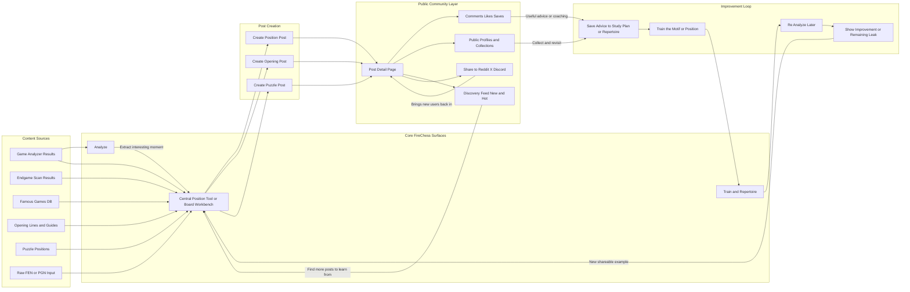

# FireChess Social Layer Plan

## Key Findings

- FireChess should stay an Aimchess-style analysis and training product with a social layer around it, not pivot into a generic community-first chess app.
- The analyzer should generate the social objects. Openings, positions, and puzzles should come out of reports and analysis results instead of relying on a blank posting composer.
- A single post model should support `position`, `opening`, and `puzzle`, with positions as the primary launch UX because they are the easiest to create, discuss, and share.
- FireChess should likely have a central board or position creation tool, similar in importance to the FractalSet viewer, but it should support the existing analyzer rather than replace it.
- That central tool should support loading from FEN, PGN, analysis results, famous games, and endgame scan outputs so people can create or share posts quickly from anywhere in the product.
- The intended loop is: analyze games, extract interesting moments, publish a post, get comments or coaching, convert advice into training or repertoire changes, then re-analyze later to show improvement.
- FireChess already has immediate post supply because analysis generates many positions that can be turned into social posts right away.
- Endgame scan outputs are also strong candidates for public posts and should be treated as first-class position sources.
- The best share object is not a generic report card. It is a board state with a concrete prompt such as "What is the best move here?" or "Why do I keep getting this position wrong?"
- Good posts should also be able to generate lightweight share assets such as branded images and GIFs, especially for Reddit where a silent visual teaser is often a better fit than a narrated short.
- User profiles should not just hold posts. They should also become organized collections of positions, puzzles, openings, and flashcard-style training artifacts derived from those posts.
- This should improve the site if community stays tightly connected to improvement. It becomes confusing only if the feed turns into a separate product disconnected from Analyze and Train.
- Expected upside is stronger for virality than for overall retention. A good version should raise shareability materially, while retention lift is most likely for engaged users, improvers, coaches, and repeat posters.
- Reddit and other social channels are more likely to pick up positions, puzzles, and opening questions than broad analysis summaries, especially if the post has a clean board image, short prompt, and interactive link.
- Keep the current auth stack for now. At 300 to 400 users, moving to Clerk is likely premature. The next step is to strengthen public identity on top of Auth.js with handles, profile controls, account-link stability, and moderation primitives.

## Flow Diagram

### Diagram Reading

- `Analyze` remains the main engine that finds interesting moments.
- The central board tool becomes the universal creation surface for turning those moments into public objects.
- All content sources should be able to feed into the same board tool so the product does not splinter into separate creation flows.
- Posts flow into comments, profiles, discovery, and external sharing.
- Share assets such as images and GIFs should sit on top of posts as distribution formats rather than becoming their own separate content system.
- Useful feedback should feed back into study plans, repertoire work, training, and later re-analysis.
- The loop closes when improvement creates new examples worth sharing again.

## Core Recommendation

Keep FireChess as an Aimchess-style analysis and training product, then add a public social layer around shareable chess artifacts.

The FractalSet analogy is not "turn the site into a social network." It is "make the core object discoverable, discussable, and shareable."

On FractalSet, the shareable unit is a coordinate or discovery.

On FireChess, the shareable unit should be a board state with a concrete purpose:

- a position where someone wants help
- an opening line someone wants to show or ask about
- a puzzle someone wants to share, solve, or discuss

That keeps the product coherent. Community should orbit the analysis engine, not replace it.

## Product Shape

Recommended shape: Aimchess core plus a public social knowledge layer.

Do not pivot into a generic community-first chess app.

The site should still read like this:

1. Analyze your chess.
2. Find your leaks.
3. Train to fix them.
4. Share interesting positions, puzzles, and opening ideas.
5. Get coaching, comments, and discovery from other players.

That is a stronger product than either extreme:

- better than pure utility, because it gives people a reason to come back and talk
- better than pure community, because it still has a sharp reason to exist

## Why This Fits FireChess

Right now the core loop is useful, but mostly private:

- analyze games
- inspect mistakes
- train alone
- maybe share a report card

That is strong for utility, but weak for virality.

FireChess already has useful building blocks for a social layer:

- saved reports
- profiles
- share cards
- public content pages
- threaded support conversations that can inform comment UX
- chessboard and position rendering primitives

So this is not a new product from zero. It is a product extension that matches the existing architecture.

## Best Launch Shape

Use one unified post model with three content kinds:

- `position`
- `opening`
- `puzzle`

But make positions the primary UX at launch.

Why positions first:

- easiest to create
- easiest to understand in a feed
- easiest to ask for help on
- easiest to share on Reddit, X, Discord, or forums
- naturally supports coaching and discussion

Openings and puzzles should still be supported, but they should feel like variations of the same post system, not separate mini-products.

## Central Position Tool

FireChess should likely have a central board or position workbench that plays a role similar to the FractalSet viewer.

This should become the easiest place on the site to create, inspect, remix, and share chess objects.

It does not need to replace the analyzer as the main identity of the product, but it should become a major creation surface because it lowers the friction to posting.

The right framing is:

- Analyze stays the main improvement engine.
- The central board tool becomes the main creation and sharing engine.

This tool should support loading from multiple sources:

- raw FEN
- raw PGN
- positions extracted from analysis results
- famous games from the existing database
- opening lines already stored in the product
- endgame scan outputs
- puzzle positions

The current game analysis feature is the right starting point, but it likely needs to grow into a broader board tool rather than remain a narrow analysis-only surface.

That tool should let users:

- load a position instantly
- step through a PGN
- trim to a single interesting moment
- attach a prompt or explanation
- publish as a position, opening, or puzzle post
- save to profile or collection

This makes sharing much easier and keeps the social layer anchored around the same board-state object everywhere.

### CTA Strategy

FractalSet makes the viewer extremely central, with navbar presence and repeated calls to action.

FireChess should borrow the principle, but probably not copy the exact intensity on day one.

Recommended approach:

- keep Analyze as the primary top-level CTA
- add the board tool to the top navbar as a clear secondary creation surface
- add contextual CTAs into reports, puzzles, openings, famous games, and endgame scan outputs

If the board tool proves to be a major posting and sharing driver, it can become more central over time.

## Discovery Ranking

The public community surface should support both `New` and `Hot` views.

`New` should show the freshest posts.

`Hot` should rank positions, puzzles, and openings based on a blend of engagement signals such as:

- likes
- comments
- saves
- recency
- possibly click-through or dwell later

That gives useful or controversial positions a path to travel across the site instead of disappearing into a chronological feed.

## Profile Collections and Training Loops

User profiles should become durable chess portfolios rather than a loose feed of past activity.

Posts created from analysis should be able to land automatically in organized profile collections such as:

- my puzzles from real games
- positions I asked for help on
- opening spots I keep studying
- endgames I learned from
- favorite posts or saved examples

These collections should be shareable on their own so a user can link not only to one post, but also to a profile that reflects their chess identity and progress.

Profiles should also be able to turn shared positions into training material.

Good candidates are:

- flashcards from posted positions
- spaced-repetition review of mistakes or motifs
- puzzle sets generated from the user's own games
- opening reminders tied to shared lines

That makes posting useful even if external sharing is modest, because each post still becomes part of the user's personal training system.

## Share Asset Strategy

The public post is the core object.

Share assets are the teasers that help the post travel.

Recommended share formats:

1. Static image card for the fastest and cheapest sharing.
2. Branded GIF or short silent loop for Reddit-friendly motion previews.
3. Interactive post page as the destination where discussion, profile value, and training hooks live.

For Reddit specifically, GIFs are likely a better fit than full AI-narrated shorts.

Why:

- they are cheaper to generate
- they do not require voiceover
- they match how chess positions are often consumed socially
- they can reveal one move, tactic, trap, or endgame idea quickly

A good GIF can show:

- the initial board state
- a prompt such as "White to move" or "Why is this winning?"
- one or two highlighted moves or arrows
- the tactical or strategic reveal
- FireChess branding and a link cue

The user should be able to choose whether a post shares with:

- a static board preview
- a branded GIF preview
- the plain interactive link

This keeps the share system flexible without forcing every post into the same format.

### Shorts

Short-form video may still matter later for TikTok, Reels, or YouTube Shorts, but it should be treated as a secondary future layer rather than a launch requirement.

The durable core should be:

- position or puzzle post first
- image or GIF distribution second
- short-form video only later if it proves worth the cost and moderation complexity

## Why People Share FireChess Posts

FractalSet posts travel because they are visually intriguing discoveries.

FireChess posts will travel for a different reason: they invite participation.

People are likely to share a FireChess post when it is:

- a challenge to solve
- a position that creates disagreement or debate
- a relatable blunder or painful mistake
- a useful opening trap or idea
- an instructive endgame moment
- part of the user's public identity or progress story

The equivalent of FractalSet coordinates is not just a screenshot.

It is a link that preserves the exact chess moment:

- board state
- move sequence or PGN context
- prompt or question
- comments and discussion
- author profile
- ability to save it into training or collections

The goal is to give users a better chess artifact than they could make manually with a screenshot alone.

## Planned Product Direction

### 1. Keep Analyze and Train as the main pillars

Do not replace the current product framing.

Add a third public discovery pillar rather than a full repositioning.

### 2. Create a unified community post model

One post entity should support:

- author
- title or prompt
- body or explanation
- FEN or move sequence
- visibility
- tags
- engagement counts
- post kind: position, opening, or puzzle

This keeps the product from splitting into three unrelated systems.

### 3. Extend profiles into public chess portfolios

Profiles should become more than saved reports.

They should show:

- shared positions
- opening ideas
- posted puzzles
- saved collections
- auto-categorized folders or collections derived from post type
- flashcard and training decks created from posted positions
- coaching or creator identity
- possibly post performance or community reputation later

### 4. Add public discovery surfaces

Build:

- a community or explore feed
- a `New` and `Hot` split for discovery
- post detail pages
- public profile pages
- strong Open Graph and Twitter previews

The feed should not be generic noise. It should be organized around useful chess objects.

### 5. Add creation hooks from existing FireChess loops

Do not launch with only a blank composer.

Users should be able to create posts from current workflows:

- turn an analyzed mistake into a position post
- turn an opening insight into a shared line
- turn a puzzle into a challenge or help request
- turn an endgame scan result into a public endgame position post
- turn a report pattern into a discussion prompt
- launch the same flow from the central board tool when the user starts from FEN, PGN, or a famous game

This is important. The current product already generates interesting raw material. The new layer should expose it.

### 6. Add comments and coaching replies

The existing ticket thread architecture is a strong reference for a first version of comments.

The initial interaction model can be simple:

- comments
- replies
- likes or saves
- follows or coach endorsements later

No need to start with private messaging or real-time chat.

### 7. Seed supply before pushing growth

The first feed cannot be empty.

Use:

- curated staff posts
- examples from famous games
- report-derived positions
- selected opening lines
- selected puzzles

If the feed launches empty, the social layer will feel fake or abandoned.

### 8. Update homepage and navigation only after density exists

Once there is enough content, expose it more strongly on:

- homepage
- navbar
- profile
- analysis results
- training pages

## Suggested MVP

The smallest strong MVP is:

1. Public post model with `position`, `opening`, and `puzzle` support.
2. Position-first composer.
3. Public feed.
4. Public post detail page.
5. Comments and replies.
6. Public profiles with shared posts.
7. Share cards and social previews.
8. Optional GIF generation for high-value post types.
9. Creation hooks from report, openings, puzzle pages, and endgame scan outputs.
10. Seeded starter content.

That is enough to test whether the loop works without overbuilding.

## Risks

### Risk: It makes the site confusing

This is a real risk if community becomes a second unrelated product.

It stays clear if the messaging remains:

- FireChess helps you improve
- community helps you discuss and share the positions that matter

Confusion happens if the feed becomes the homepage identity before the community loop proves itself.

### Risk: Low posting volume

Most users will not create original posts unless it is very easy and they already have something worth sharing.

That is why creation should come from existing FireChess outputs instead of a blank posting flow.

### Risk: Empty or low-quality feed

This is why seeding and curation matter.

### Risk: Moderation burden

Any public posting surface needs moderation controls, rate limits, and reporting.

## Expected Impact

## Will this improve the site or make it too confusing?

My view: it will improve the site if it is added as a layer around the current loop, not as a replacement for it.

FireChess right now is strong on utility and weaker on public identity, conversation, and network effects.

This idea directly addresses that weakness.

The wrong version is:

- a random community tab
- a generic feed
- a bunch of posting tools disconnected from analysis and training

The right version is:

- analyze something
- publish the interesting part
- get feedback or coaching
- bring people back into training

That is coherent.

## Likely retention impact

If executed well, I would expect moderate to strong retention upside, mainly for engaged users rather than the entire user base.

Rough expectation:

- casual users: small lift unless the posting and discovery flow is extremely simple
- engaged improvers: meaningful lift because discussion, feedback, and public collections create a reason to return
- creators or coaches: strong lift if profiles and post history become valuable assets

Reasonable directional estimate for an actually good implementation:

- short-term retention lift: maybe 10 to 25 percent for the engaged cohort
- long-term retention lift: potentially larger if profiles, collections, and feedback loops become habit-forming

That is not a guarantee. It depends heavily on content density and ease of posting.

## Likely virality impact

This has clearer virality upside than retention upside, because it creates a better share object.

Right now a report card is shareable, but a position with a question is more conversational.

People are more likely to share things like:

- "What is the best move here?"
- "Why is this position winning?"
- "I keep getting crushed in this opening. What am I missing?"
- "Can someone explain this tactic?"
- "Is this sacrifice actually sound?"

Those prompts are naturally social.

Reasonable expectation if the product is well executed:

- share rate should rise materially versus report-only sharing
- social traffic from Reddit, Discord, and X should be noticeably better
- public SEO surface area should increase because post pages and profiles create many indexable entry points

## Will people post or share positions on Reddit more?

Yes, likely more than they would share generic analysis reports.

People already post positions constantly when the object is easy to understand and discuss.

What makes them share is not "I used an analysis site."

What makes them share is:

- a surprising position
- a concrete question
- disagreement about the right move
- a puzzle-like moment
- an instructive opening trap or idea
- public identity and ownership over the post

So the answer is yes, but only if the post object is good.

For Reddit especially, the likely winners are:

- clean board image
- short caption or question
- one-click link to the interactive version
- comments already active on the FireChess page
- a visible author profile or improvement context

If the post looks like a useful chess object instead of a product screenshot, it is much more likely to travel.

## What Would Most Improve Success

1. Make sharing come directly from analysis results, not from a separate composer.
2. Make the default share object a position with a prompt, not a generic report.
3. Give users organized profile collections so posts feel like lasting assets instead of disposable content.
4. Prioritize strong preview images and optional GIFs for Reddit-friendly sharing.
5. Seed the first feed with high-quality examples.
6. Let public discussion feed users back into analysis and training.
7. Keep the homepage and navigation centered on improvement, not generic community.

## Concrete Success Metrics

Track these from the beginning:

1. Post creation rate.
2. Share rate per post kind.
3. Click-through rate from shared links.
4. Comments per post.
5. Repeat visits to authored posts and profiles.
6. Conversion from public post viewer to signed-in user.
7. Retention difference between posters, commenters, and non-participants.
8. GIF or image share usage by post type.
9. Click-through rate from Reddit and other social shares.
10. Flashcard or training reuse rate from shared posts.

## What Is Still Needed Before Implementation

The strategy is clear enough to build, but a few concrete product decisions should be made before implementation starts.

### Product Decisions

- define the canonical post schema for `position`, `opening`, and `puzzle`
- define how profile collections are created: manual, automatic, or hybrid
- define the first set of post creation entry points inside Analyze, puzzles, openings, and endgame scan outputs
- define what qualifies for `Hot` ranking and how much likes, comments, saves, and recency should matter
- define which share asset types ship in v1: static image only, or static image plus GIF

### Identity and Permissions

- define public handles and profile visibility rules
- define who can comment, like, save, and create posts
- define moderation, reporting, rate limits, and anti-spam rules
- define how account linking should work across Google, Lichess, and email login

### Central Board Tool Scope

- define the minimum viable feature set for the board workbench
- decide which sources ship first: analysis, FEN, PGN, famous games, endgames, openings, puzzles
- define how users trim a full game into a single shareable moment
- define whether engine lines, arrows, and annotations are editable before posting

### Share Asset Requirements

- define the visual templates for static cards
- define the first GIF templates and which post types support them
- define FireChess branding rules for shared media
- define which metadata and social preview fields each public post page should expose

### Training and Profile Loops

- define how a post becomes a flashcard or training item
- define whether flashcards are generated automatically or opt-in
- define how shared posts connect back into study plans, repertoire, or daily review

### Analytics and Launch Controls

- define the success metrics dashboard before launch
- seed enough starter content so the feed is not empty
- decide whether posting is open to all users immediately or rolled out gradually
- decide whether GIF generation is available to everyone, curated only, or quota-limited at launch

## File and Implementation Anchors

- `app/page.tsx`: keep analysis dominant while adding community teasers
- `components/navbar.tsx`: add discovery or community without diluting core navigation
- `app/profile/page.tsx`: evolve toward public portfolios
- `lib/schema.ts`: add posts, comments, reactions, and public profile fields
- `app/api/feedback/route.ts`: reference current thread creation and listing pattern
- `app/api/feedback/[id]/route.ts`: reference reply handling and permissions
- `app/support/page.tsx`: reference user discussion list patterns
- `app/support/[id]/page.tsx`: reference thread UI patterns
- `lib/share-report.ts`: adapt into share cards for posts
- `app/opengraph-image.tsx`: extend social preview generation
- `app/openings/page.tsx`: add opening-to-post entry points
- `app/puzzles/page.tsx`: add puzzle discussion or help entry points
- `app/positions/page.tsx`: strong starting template for position-focused public content
- `app/games/[slug]/page.tsx`: reference SEO-friendly public detail pages

## Final Recommendation

Build this as a position-centric public layer on top of FireChess, not as a product pivot.

If you execute it tightly, I think it makes the site better, more alive, more shareable, and more memorable.

If you execute it loosely, it risks becoming a confusing side area with low activity.

The deciding factor is not whether social exists. The deciding factor is whether the social object is tightly connected to the existing improvement loop.
